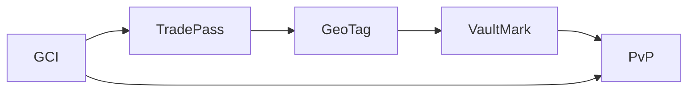
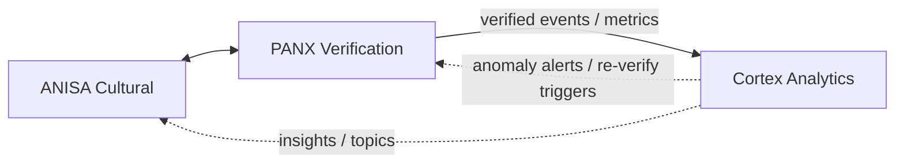
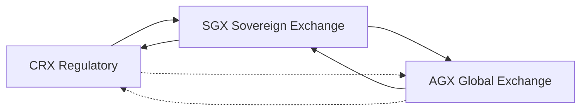
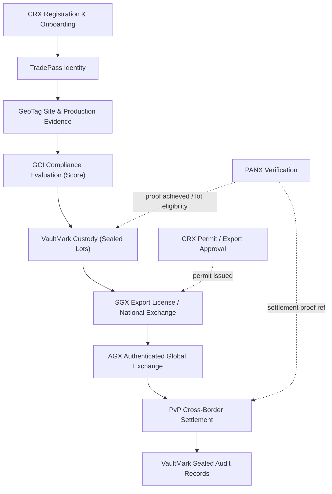
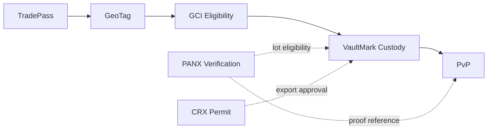
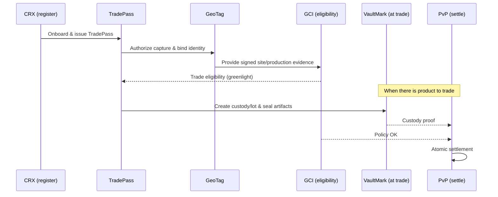

<p align="center">
  
</p>

# GTCX Protocol Ecosystem

Public home for the GTCX verification protocols and sovereign platforms.

   

Last updated: 2025‑09‑03 07:20Z

## Table of contents
- Executive summary
- Who this is for
- Problems we solve
- Protocols (foundation) — deep dives
- Three‑tier architecture
- Open‑source platforms & tooling
- End‑to‑end data flow and visuals
- Five flagship use cases
- Pilot in one week (checklist)
- Spec links
- FAQ and Glossary
- Community & contributions

> Start here: protocols index → `research/02-protocol-specifications/l1-core-protocols/` • platforms overview → `gtcx-ecosystem-platforms/README.md` • e2e demo (PANX↔Cortex) → `gtcx-ecosystem-cognitive/README.md`

## Executive summary
GTCX is sovereign verification infrastructure for global trade. Five core protocols — TradePass, GeoTag, GCI, VaultMark, and PvP — convert claims into machine‑verifiable proofs that CRX, SGX, and AGX use to automate permits, listings, and settlement. The result is moving from weeks of paperwork and opaque intermediaries to same‑day approvals and sub‑second settlement.

Outcomes (targets from the technical advisors primer):
- Identity: 3 weeks → ~30 seconds (TradePass)
- Origin proof: “impossible” → instant (GeoTag)
- Compliance eligibility: 3 weeks → ~2 minutes (GCI)
- Permit issuance: typical ≤ 6 hours (CRX)
- Custody: continuous, sealed audit across transfers (VaultMark)
- Settlement: atomic PvP < 1 second; scales to 10M+ daily transactions

### System at a glance (from technical advisors primer)
- TradePass: identity verification 3 weeks → ~30 seconds; capacity ~1M entities/day
- GeoTag: origin proof from “impossible” → instant (cryptographic GPS signatures + device attestation)
- GCI: compliance evaluation 3 weeks → ~2 minutes (policy engine + attestations)
- VaultMark: continuous digital chain of custody; instant ownership verification; sealed audit
- PvP: atomic payment‑versus‑physical; settlement < 1s; scales to 10M+ daily transactions

## Who this is for
- Governments and regulators seeking sovereignty‑preserving digital infrastructure
- Verified producers and cooperatives needing market access with trust guarantees
- Exchanges, vaults, and banks integrating proof‑based settlement
- Integrators and open‑source builders adopting a protocol‑first stack

## Problems we solve
- Fragmented identity and inconsistent policy enforcement across jurisdictions
- Location/provenance fraud and unverifiable documentation
- Trust bottlenecks that slow approvals, trading, and settlement
- Audit gaps and verification “washing” through custody chains

## Protocols (foundation)
Core protocol specifications live in `gtcx-ecosystem-research/02-protocol-specifications/`.
- TradePass — identity & authorization (DIDs/VCs, roles, entitlements)
- GCI — compliance & policy (credentials, attestations, scoring)
- GeoTag — evidence (cryptographic location, timestamping, device attestation)
- VaultMark — audit (sealed receipts, custody chain)
- PvP — settlement (post‑verification, atomic payment‑versus‑physical)

Transport and data contracts use JSON Schema with versioned `$id`.

### The five protocols (deep dives)
- TradePass (Identity & Authorization): DIDs/VCs, role catalogs, time‑boxed grants, least‑privilege; composes with GCI and PANX weights
- GCI (Compliance & Policy): attestations, algorithmic scoring, jurisdictional policies, predictive risk; gates roles and settlement
- GeoTag (Evidence): multi‑constellation GPS, satellite correlation, HSM signatures, Merkle proofs; replaces claims with proofs
- VaultMark (Audit): physical‑digital binding (NFC/RFID), digital twins, immutable custody; prevents verification washing
- PvP (Settlement): atomic payment‑versus‑physical; settlement only when proof+policy pass

<!-- Removed high-level A→B→C diagram to reduce redundancy -->

### Spec links
- CRX/SGX Exchange Integration: `research/02-protocol-specifications/l3-exchange-layer/crx-sgx-exchange-integration.md`
- AGX (Authenticated Global Exchange): `research/02-protocol-specifications/l3-exchange-layer/agx-authenticated-global-exchange.md`

### Verification layers → platforms (visual)


## Five flagship use cases
- Permit issuance: GCI + TradePass + VaultMark; hours instead of weeks
- Depart/arrive verification: GeoTag + VaultMark → PANX proof; real‑time alerts
- Corridor policy enforcement: GCI + TradePass; transparent, consistent governance
- Milestone‑based payment: PANX proof → PvP + VaultMark; risk‑free release
- Dispute packet: VaultMark + GeoTag + GCI; complete sealed evidence

## Pilot in one week (checklist)
1) Site onboarding: issue TradePass, bind GeoTag devices, enable VaultMark
2) Capture: record depart/arrive events with signed evidence
3) Verify: PANX proof thresholds per event type
4) Govern: GCI policy gates; simulate corridor rules
5) Settle: dry‑run PvP release conditions
6) Report: sealed audit bundle + metrics

## FAQ
- Is PANX a protocol? No. PANX is a verification service that consumes protocol artifacts to produce network proofs.
- What’s sealed? Proofs, custody events, and artifacts via VaultMark.
- How do I pilot? Start with GeoTag + VaultMark at one site; add GCI/TradePass; then PANX; gate PvP last.

## Glossary
- Protocol — shared rulebook and data contracts
- Proof — evidence‑backed claim you can independently verify
- Seal — tamper‑evident record preserved for audit
- Atomic settlement — payment/delivery only complete together

## Three‑tier architecture
1) Protocols — specifications and data contracts (research repo)
2) Reference services — PANX, Cortex, ANISA (this org)
3) Platforms & apps — open‑source frontends, terminals, and integrations

#### Protocols layer

Protocols are composable, not strictly linear. TradePass authorizes capture, GeoTag produces signed evidence, VaultMark seals artifacts, and PvP gates settlement. GCI applies policies into both authorization and settlement.

#### Reference services layer

Reference services enrich, verify, and analyze protocol artifacts. ANISA adds cultural context; PANX turns evidence + policy into network proofs; Cortex aggregates and visualizes signals for operators.

##### What actually happens (inputs → processing → outputs)
- ANISA (enrichment)
  - Inputs: site/production notes, local terms, stakeholder roles (TradePass), region hints (GeoTag)
  - Processing: cultural cues, etiquette, conflict‑avoidant phrasing, authenticity risk signals
  - Outputs: `{ authenticity_hint, tone_guidance, risk_notes[] }`
- PANX (verification)
  - Inputs: VaultMark lot metadata, GeoTag evidence, TradePass roles, GCI eligibility/policy
  - Processing: role‑weighted thresholds per event type, dissent capture, reasoned hints
  - Outputs: `{ proof_id, achieved: true|false, percentage, hints[], dissent[], contract_version }`
- Cortex (analytics)
  - Inputs: PANX proofs/events, custody/market telemetry, operator annotations
  - Processing: streaming aggregations, anomaly detection, trend/impact analyses
  - Outputs: `{ anomaly_alerts[], reverify_triggers[], dashboards, policy_insights[] }`

##### Representative messages
```json
// PANX verification proof (response)
{
  "proof_id": "pxf_01HZYZ...",
  "event_type": "lot_eligibility",
  "achieved": true,
  "percentage": 0.82,
  "hints": ["geo_tag_ok", "gci_pass", "roles_weight_met"],
  "dissent": [],
  "ts": 1756890000,
  "contract_version": "v1.0"
}
```

```json
// Cortex anomaly alert (to operators)
{
  "alert_id": "alrt_9b2...",
  "lot_id": "vm_lot_gh_2025_001",
  "signal": "pattern_deviation",
  "reason": "unusual transit dwell time",
  "recommendation": "trigger_reverify",
  "trigger": { "type": "panx_reverify", "payload": { "event_type": "custody_check" } }
}
```

```json
// ANISA enrichment (to PANX/CRX)
{
  "authenticity_hint": 0.74,
  "tone_guidance": "de‑escalating, collaborative",
  "risk_notes": ["local_holiday_window", "prefer_morning_contact"]
}
```

##### SLOs (typical targets)
- ANISA enrichment: p95 < 150ms
- PANX verification (single event): p95 < 500ms; batch proofs: p95 < 2s
- Cortex alerting/trigger propagation: p95 < 1s end‑to‑end

#### Platforms layer

Platforms interoperate rather than strictly chain. CRX feeds sovereign approval/compliance into SGX; SGX returns market and custody events back to CRX. AGX connects multiple SGX instances to international buyers; limited CRX↔AGX links exist for export controls and revenue reporting.

## Reference services (live repos)
- PANX (Oracle/Verification): `gtcx-ecosystem-cognitive/panx` — consensus, proofs, forward to Cortex
- Cortex (Analytics): `gtcx-ecosystem-cognitive/cortex` — ingest, summary, anomalies
- ANISA (Cultural Intelligence): `gtcx-ecosystem-anisa` — analyze/assess endpoints for enrichment

Each service includes: README, user/agent guides, runbooks, deploy guides, JSON Schemas, and changelogs.

## Open‑source platforms & tooling
- CRX — government workflow automation & regulatory processing
- SGX — sovereign national exchange & settlement
- AGX — authenticated global exchange (international marketplace)
- Terminal & UI shells — operator dashboards and community views (repos under `gtcx-ecosystem-platforms/`)
- APIs & gateways — shared adapters and routing (`gtcx-ecosystem-api-gateway/`)
- Research & specs — canonical protocol drafts and design notes (`gtcx-ecosystem-research/`)

### Access layer: CaaS, VIA, VXA
- CaaS: simple APIs that wrap protocol workflows for apps and services
- VIA (teach & guide) and VXA (inspect & verify) mobile apps leverage the protocols end‑to‑end
- See: `gtcx-ecosystem-platforms/README.md` (platforms overview and app shells)

### End‑to‑end trade process (custody before SGX)


### Verification gates (at a glance)


### End‑to‑end sequence (eligibility first, then trade)


### “Trade in ~6 hours” (from primer)
- Identity verified (TradePass): ~30 seconds
- Site/production evidence (GeoTag): instant
- Compliance eligibility (GCI): ~2 minutes
- Permit issuance (CRX): target same‑day, typical ≤ 6 hours
- Listing & broadcast (SGX→AGX): instant after permit
- Atomic settlement (PvP): < 1 second when trade executes

### Performance snapshots
VaultMark (chain of custody)

| Before | After (VaultMark) |
| --- | --- |
| Paper trail breaks, mixing common | Unbroken digital chain, sealed records |
| 3–5 days to verify ownership | Instant verification |
| Frequent custody disputes | Cryptographic proof across transfers |

PvP (settlement)

| Before | After (PvP) |
| --- | --- |
| 3–5 business days wire transfer | Atomic settlement < 1s |
| Intermediaries required | Direct counterparty exchange |
| 15% failed trades, exposure risk | Both‑or‑neither finality |

## Contracts and versioning
- Schemas: JSON Schema with stable `$id` and semantic versioning
  - Shared interfaces: `gtcx-ecosystem-cognitive/shared/interfaces/`
  - PANX request/response: `panx_verification_event.schema.json`, `panx_verify_response.schema.json`
  - Cortex ingest: `cortex_ingest_event.schema.json`
- Runtime signaling
  - Response header: `X-Contract-Version: vMAJOR.MINOR`
  - Backward‑compatible additive changes bump MINOR; breaking changes bump MAJOR with deprecation window
- Tooling & checks
  - Compatibility script: `gtcx-ecosystem-cognitive/shared/interfaces/contracts_compat_check.py`
  - CI suggestion: validate schemas + sample instances on PRs (can be run locally now)
  - Environment override for schema paths in containers: see `panx/service/app/validation.py`

## Deploy
- Local Docker Compose (PANX + Cortex + DB)
  - Compose: `gtcx-ecosystem-cognitive/docker-compose.yml`
  - PANX service: `gtcx-ecosystem-cognitive/panx/service/README.md`
- GCP VM (TLS via Caddy)
  - Overlay & guide: `gtcx-ecosystem-cognitive/infra/compose-prod/README.md`
  - Env template: `gtcx-ecosystem-cognitive/infra/compose-prod/ENV.example`
- ANISA API
  - Deploy guide: `gtcx-ecosystem-anisa/agile-pm/deploy_gcp_vm.md`
- Planned
  - Helm charts & GKE Autopilot manifests
  - Terraform modules for VM + DNS + secrets

## Roadmap (high‑level)
- Protocol hardening & specification snapshots
  - TradePass, GCI, GeoTag, VaultMark, PvP: stabilize core semantics and data contracts
  - Snapshot cadence and change control (proposal → review → RFC → snapshot)
  - Conformance test suite and fixtures per protocol (positive/negative cases)
- Schema‑first development
  - Semantic versioning rules, deprecation windows, and upgrade playbooks
  - Reference client SDKs for TypeScript/Python (schema‑bound types, validators)
  - CI gates for schema compatibility and sample instance coverage
- Interoperability & federation (from protocols repo roadmap)
  - TradePass federation and identity linking across jurisdictions
  - PvP multi‑rail connectors (banking, mobile money, crypto) with atomicity proofs
  - GeoTag secure attestation (device certs, HSM rotation, field audit trail)
  - VaultMark smart seal program and digital twin APIs
- Persistence & retention
  - Managed Postgres/Timescale for proofs/events, partitioning and TTL policies
  - Audit archive export (cold storage bundles signed by VaultMark)
- Observability
  - Service metrics and SLOs; dashboards for operators and regulators
  - Distributed tracing with selective sampling; alert runbooks
- Agentic behaviors (progressive)
  - PANX: borderline re‑verify plans; dynamic thresholds informed by risk/quality
  - Cortex: anomaly watchers, action proposals, operator copilot integrations
- Pilots & reference implementations
  - Corridor deployments with partners; playbooks for CRX/SGX/AGX rollout
  - Telegram onboarding funnels linked to TradePass/GeoTag quickstarts

See also: Protocols roadmap in `gtcx-ecosystem-protocols/README.md` (Future Roadmap section).

## Community
- Issues and discussions in each repo (use repo issue trackers)
- Contributions welcome: docs, specs, code, diagrams
- Security: report privately to maintainers before public disclosure

MIT License

---

Contributions & governance: open issues/PRs against component repos; follow per‑component CHANGELOGs for releases (`gtcx-ecosystem-cognitive/CHANGELOG.md`, `gtcx-ecosystem-anisa/CHANGELOG.md`, `gtcx-ecosystem-cognitive/panx/changelog.md`, `gtcx-ecosystem-cognitive/cortex/changelog.md`).

## Telegram onboarding (fast path)
- Telegram bot utilities and onboarding flows:
  - `gtcx-ecosystem-shared/utilities/gtcx-utility-telegrambot/README.md`
  - `gtcx-ecosystem-shared/utilities/gtcx-utility-tradedesk/README.md`
  - Master onboarding playbook: `gtcx-ecosystem-shared/utilities/gtcx-utility-tradedesk/agentic/gtcx-master-onboarding.md`
- Typical flow: chat‑based TradePass issuance → GeoTag device pairing → basic compliance prompts → CRX pre‑registration → links into SGX/AGX portals when eligible.
