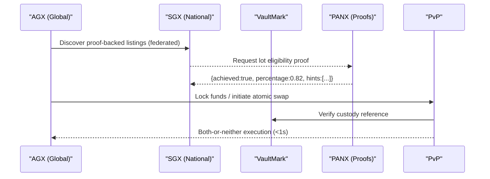
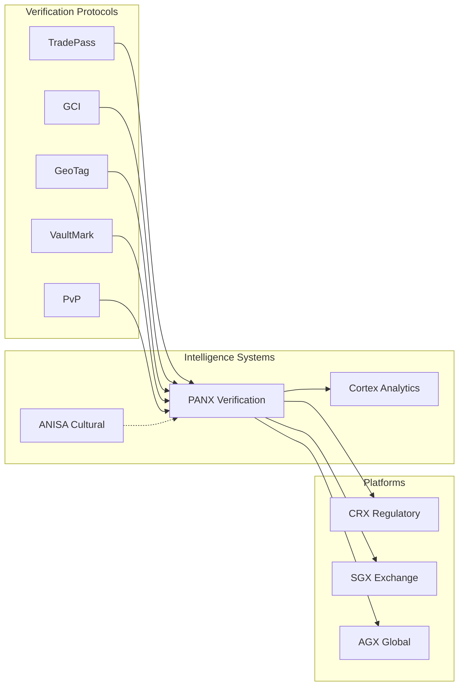
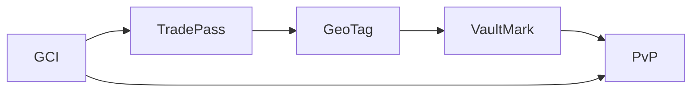
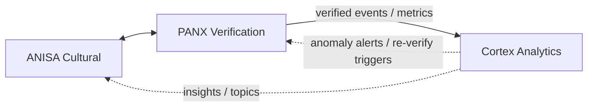
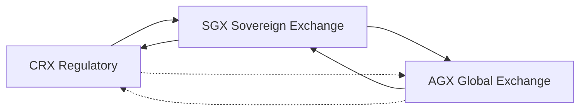
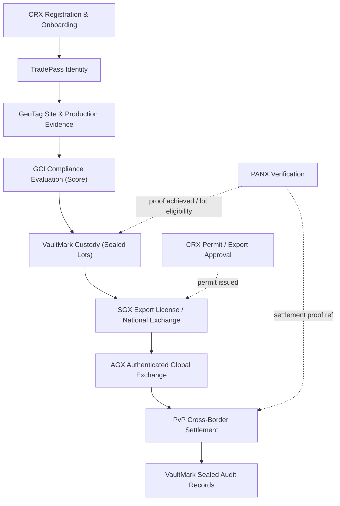
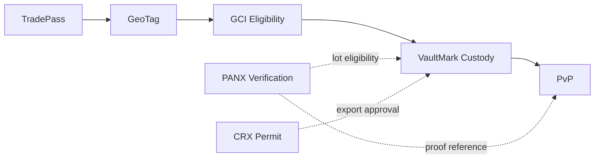
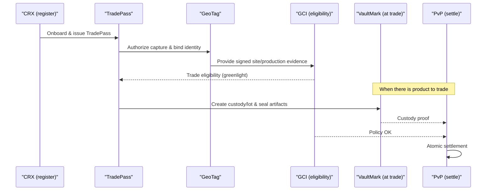
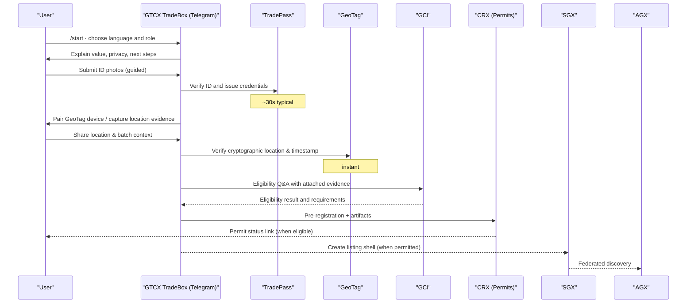

<p align="center">
  
</p>

# GTCX Protocol Ecosystem

Public home for the GTCX verification protocols and sovereign platforms.

   

Last updated: 2025‑09‑03 08:00Z

## Table of contents 🧭
- Executive summary ✨
- Who this is for 🎯
 - What is needed for trade (and why) ✅
- Day in the life 📽️
- Problems we solve 🧩
- Protocols (foundation) — deep dives 📜
- Three‑tier architecture 🏗️
- Open‑source platforms & tooling 🧰
- End‑to‑end data flow and visuals 🔄
- Five flagship use cases 🚀
- Pilot in one week (checklist) 🧪
- Platforms overview 🏛️
- FAQ and Glossary 🙋
- Community & contributions 🤝

> Start here: protocols index → `research/02-protocol-specifications/l1-core-protocols/` • platforms overview → `gtcx-ecosystem-platforms/README.md` • e2e demo (PANX↔Cortex) → `gtcx-ecosystem-cognitive/README.md`

## Executive summary ✨
GTCX is sovereign verification infrastructure for global trade. Five core protocols — TradePass, GeoTag, GCI, VaultMark, and PvP — turn real‑world statements and documents into independently verifiable proofs that CRX, SGX, and AGX use to automate permits, listings, and settlement. The result is moving from weeks of paperwork and opaque intermediaries to same‑day approvals and sub‑second settlement.

### By the numbers
| Signal | Value |
| --- | --- |
| Global commodity trade | ~$13T annually |
| Value lost to frictions | ~30% (≈$3.9T) |
| Identity verification | 3 weeks → ~30 seconds |
| Compliance eligibility | 3 weeks → ~2 minutes |
| Permit issuance (CRX) | typical ≤ 6 hours |
| Settlement (PvP) | atomic < 1 second; 10M+ daily tx scale |

Outcomes (targets from the technical advisors primer):
- Identity: 3 weeks → ~30 seconds (TradePass)
- Origin proof: “impossible” → instant (GeoTag)
- Compliance eligibility: 3 weeks → ~2 minutes (GCI)
- Permit issuance: typical ≤ 6 hours (CRX)
- Custody: continuous, sealed audit across transfers (VaultMark)
- Settlement: atomic PvP < 1 second; scales to 10M+ daily transactions

### System at a glance (from technical advisors primer)
- TradePass: identity verification 3 weeks → ~30 seconds; capacity ~1M entities/day
- GeoTag: origin proof from “impossible” → instant (cryptographic GPS signatures + device attestation)
- GCI: compliance evaluation 3 weeks → ~2 minutes (policy engine + attestations)
- VaultMark: continuous digital chain of custody; instant ownership verification; sealed audit
- PvP: atomic payment‑versus‑physical; settlement < 1s; scales to 10M+ daily transactions

## Who this is for 🎯
- Governments and regulators seeking sovereignty‑preserving digital infrastructure (e.g., permits in ≤ 6 hours; +40% revenue capture seen in models)
- Verified producers and cooperatives needing market access with trust guarantees (direct access; better pricing)
- Exchanges, vaults, and banks integrating proof‑based, atomic settlement
- Integrators and open‑source builders adopting a protocol‑first stack

## What is needed for trade (and why) ✅
Buyers, regulators, and exchanges ask the same questions. Each answer must be verifiable.

- **Who am I buying from?** TradePass proves the identity of people and organizations and grants time‑boxed roles (e.g., exporter) so authorization is portable and auditable.
- **Where is the product sourced from?** GeoTag produces cryptographic location and timestamped evidence for production and transit events; VaultMark binds that evidence to sealed custody.
- **Is it responsibly sourced and compliant?** GCI evaluates eligibility against jurisdictional policies using attached evidence; CRX turns the result into a permit with an audit trail.
- **Do the goods I receive match what was listed?** VaultMark maintains an unbroken digital chain‑of‑custody and instant ownership checks; PANX provides proof thresholds per event type.
- **Will payment and delivery happen together?** PvP performs atomic “both‑or‑neither” settlement using VaultMark custody references and PANX proof links, eliminating exposure.

## Actors and the problems we solve
| Actor | Pain today | What GTCX provides | Outcomes (targets) |
| --- | --- | --- | --- |
| Producers & cooperatives | Identity/origin not trusted; 6‑month permits; predatory middlemen; no price discovery | TradePass, GeoTag, GCI → CRX same‑day eligibility; SGX listing; VaultMark custody; PvP settlement | Onboard ≤1 day; eligibility ~2 min; better pricing; fraud reduction |
| Exporters & aggregators | Paper chains; disputed lots; delays at ports | VaultMark sealed custody; PANX proofs; CRX/SGX routing | Instant ownership verification; fewer holds; faster throughput |
| Regulators & ministries (CRX) | Fragmented systems; leakage; long queues | CRX workflow + policy engine; GCI attestations; audit trail | Permits ≤ 6 hours; +revenue capture; transparent audits |
| Vaults, warehouses, logistics | Mixed inventory risk; manual logs; dispute exposure | VaultMark digital twins; GeoTag arrival/departure proofs | No mixing; verifiable chain; insurance/risk down |
| Buyers & traders (SGX/AGX) | Opaque provenance; counterparty risk; slow settlement | Proof‑backed listings; PvP atomic settlement | Trusted supply; <1s settlement at execution |
| Banks/PSPs & settlement rails | Reconciliation risk; chargebacks; manual compliance | PvP orchestration; proof references; policy gating | Both‑or‑neither finality; automated compliance |
| Auditors & civil society | ESG unverifiable; after‑the‑fact investigations | Sealed artifacts (VaultMark), location proofs, policy history | Real‑time verification; credible oversight |

## Day in the life (epic, but real) 📽️

### Producer (cooperative lead)
<sub>
<ol>
<li>Register cooperative in TradePass (~30s).</li>
<li>Pair GeoTag device and capture site/batch evidence.</li>
<li>GCI evaluates eligibility (~2 min).</li>
<li>CRX issues permit (≤ 6h, same‑day).</li>
<li>Create lot and seal custody in VaultMark.</li>
<li>List eligible lot on SGX.</li>
<li>Execute atomic settlement via PvP (< 1s).</li>
</ol>
</sub>


<sub>
<b>Diagram legend:</b> Solid arrows = action/request; dashed arrows = signal/reference/gate; notes = "Note over X" for timing/context; quoted names include roles (e.g., "CRX (Permits)").
</sub>

### Regulator (CRX operator)
- Intake arrives with TradePass identity and GCI eligibility attached
- CRX routes to departments; SLA timers start automatically
- Evidence links deep‑link to GeoTag artifacts and VaultMark seals
- Approver signs digitally; permit is issued with audit hash
- Dashboard shows queue, throughput, revenue capture, and anomalies
- Typical path: eligibility received ~2 min; permit turnaround same‑day (≤ 6h)

### Buyer (international)


## Problems we solve 🧩
Trade today fails in predictable ways. The GTCX stack addresses each failure with a concrete, verifiable mechanism.

- **Identity without portability**: Registries, paper IDs, and manual KYC do not travel across agencies or borders. Every jurisdiction restarts the process, creating weeks‑long queues and inconsistent permissions. TradePass issues cryptographically verifiable identities and time‑boxed roles so authorization is portable, least‑privilege, and auditable.

- **Provenance without proof**: Documents move faster than goods. By the time a lot reaches the port, origin can be disputed, lots can be mixed, and there is no independent way to verify claims. GeoTag anchors events to cryptographic location and time, while VaultMark binds those events to sealed digital custody so provenance can be checked instantly, without calling the source.

- **Policy without consistency**: Rules are clear on paper but applied differently in practice. Interpretations diverge across desks and regions, creating bottlenecks, leakage, and unpredictable outcomes. GCI evaluates eligibility the same way every time against explicit policies, and CRX turns those decisions into transparent workflows with measurable SLAs.

- **Settlement without finality**: Payment and delivery occur on separate rails, leaving counterparties exposed and disputes to escalate. PvP settles “both‑or‑neither” atomically, using VaultMark custody references and PANX proof links so execution is instant, correct, and independently auditable.

### Market reality (from primer)
| Metric | Current State | Impact |
| ---| ---| --- |
| Annual commodity trade | ~$13T | Massive addressable scope |
| Value lost to frictions | ~30% (≈$3.9T) | Efficiency upside |
| Permit processing | ~6 months | Deals die waiting |
| Origin verification | ~0% | ESG impossible |
| Digital infrastructure | Paper/PDF | 2025 still manual |

### Structural failures
- Identity without trust (weeks to verify; rampant fraud)
- Location without proof (origin mixing; unverifiable chain)
- Compliance without speed (rules change; processes don’t)
- Settlement without certainty (intermediaries; failed trades)

## Protocols (foundation) 📜
Core protocol specifications live in `gtcx-ecosystem-research/02-protocol-specifications/`.
- TradePass — identity & authorization (DIDs/VCs, roles, entitlements)
- GCI — compliance & policy (credentials, attestations, scoring)
- GeoTag — evidence (cryptographic location, timestamping, device attestation)
- VaultMark — audit (sealed receipts, custody chain)
- PvP — settlement (post‑verification, atomic payment‑versus‑physical)

Transport and data contracts use JSON Schema with versioned `$id`.

### The five protocols (deep dives)
- TradePass (Identity & Authorization): DIDs/VCs, role catalogs, time‑boxed grants, least‑privilege; composes with GCI and PANX weights
- GCI (Compliance & Policy): attestations, algorithmic scoring, jurisdictional policies, predictive risk; gates roles and settlement
- GeoTag (Evidence): multi‑constellation GPS, satellite correlation, HSM signatures, Merkle proofs; replaces claims with proofs
- VaultMark (Audit): physical‑digital binding (NFC/RFID), digital twins, immutable custody; prevents verification washing
- PvP (Settlement): atomic payment‑versus‑physical; settlement only when proof+policy pass

#### Protocol outcomes (from primer)
| Layer | Before | After |
| --- | --- | --- |
| TradePass | 3 weeks manual checks | ~30 seconds verification |
| GeoTag | Origin unverifiable | Instant cryptographic location proof |
| GCI | Weeks to evaluate | ~2 minutes eligibility |
| VaultMark | Custody breaks; disputes | Continuous sealed audit; instant ownership check |
| PvP | 3–5 day wires; exposure | Atomic settlement < 1s; both‑or‑neither finality |

<!-- Removed high-level A→B→C diagram to reduce redundancy -->

### Platforms overview (who it’s for and why it matters) 🏛️
- **CRX — Regulatory Exchange**: for ministries and agencies to automate permits and apply policy consistently. Solves long queues, leakage, and inconsistent approvals with transparent workflows and SLAs. [CRX README](gtcx-ecosystem-platforms/README.md)
- **SGX — Sovereign National Exchange**: for domestic buyers, traders, vaults, and banks to list and settle proof‑backed lots. Solves opaque provenance and counterparty risk. [SGX README](gtcx-ecosystem-platforms/README.md)
- **AGX — Authenticated Global Exchange**: for international buyers and exporters to discover and trade across federated SGX markets. Solves fragmented discovery and cross‑border execution. [AGX README](gtcx-ecosystem-platforms/README.md)

### Verification layers → platforms (visual)


## Five flagship use cases 🚀
- Permit issuance: GCI + TradePass + VaultMark; hours instead of weeks
- Depart/arrive verification: GeoTag + VaultMark → PANX proof; real‑time alerts
- Corridor policy enforcement: GCI + TradePass; transparent, consistent governance
- Milestone‑based payment: PANX proof → PvP + VaultMark; risk‑free release
- Dispute packet: VaultMark + GeoTag + GCI; complete sealed evidence

## Pilot in one week (checklist) 🧪
1) Site onboarding: issue TradePass, bind GeoTag devices, enable VaultMark
2) Capture: record depart/arrive events with signed evidence
3) Verify: PANX proof thresholds per event type
4) Govern: GCI policy gates; simulate corridor rules
5) Settle: dry‑run PvP release conditions
6) Report: sealed audit bundle + metrics

## FAQ
- Is PANX a protocol? No. PANX is a verification service that consumes protocol artifacts to produce network proofs.
- What’s sealed? Proofs, custody events, and artifacts via VaultMark.
- How do I pilot? Start with GeoTag + VaultMark at one site; add GCI/TradePass; then PANX; gate PvP last.

## Glossary 📖
- Protocol — shared rulebook and data contracts
- Proof — evidence‑backed claim you can independently verify
- Seal — tamper‑evident record preserved for audit
- Atomic settlement — payment/delivery only complete together

## Three‑tier architecture 🏗️
1) Protocols — specifications and data contracts (research repo)
2) Intelligence systems — PANX, Cortex, ANISA (this org)
3) Platforms and apps — Exchanges and Field‑First Mobile Applications

#### Protocols layer

Protocols are composable, not strictly linear. TradePass authorizes capture, GeoTag produces signed evidence, VaultMark seals artifacts, and PvP gates settlement. GCI applies policies into both authorization and settlement.

#### Intelligence systems layer 🧠

Intelligence systems enrich, verify, and analyze protocol artifacts. ANISA adds cultural context; PANX turns evidence + policy into network proofs; Cortex aggregates and visualizes signals for operators.

##### Product narratives (who it’s for, what it solves, how it feels)
- **ANISA — Cultural Intelligence (field‑first)**
  A cooperative lead opens the VIA app to register a new site. Before any photo or coordinate is taken, ANISA whispers the local terms that build trust, the questions to ask, and the proof to capture (“include the co‑op board stamp; take a wide shot of the entrance; avoid market‑day crowding at noon”). During capture it flags risks (“vendor IDs don’t match roster”) and suggests phrasing that de‑escalates (“ask for the lot book, not the receipt”). The guidance is saved alongside the artifacts so when TradePass and GeoTag submit to CRX, the evidence reads correctly the first time—less back‑and‑forth, fewer rejections.
  In short: ANISA improves the human layer so the technical layer (TradePass, GeoTag, VaultMark) lands cleanly.

- **PANX — Verification (not a protocol)**
  - Who: CRX permit approvers, SGX listing desks, banks settling PvP.
  - Problem: evidence exists but trust is subjective and slow; stakeholders need a neutral, repeatable verdict.
  - Story: given a lot and its artifacts (TradePass roles, GeoTag evidence, VaultMark custody, GCI eligibility), PANX returns a proof: `{ achieved, percentage, hints[], dissent[] }`. CRX reads the proof to gate permits; SGX uses it to list; PvP references it to settle.
  - Maps to: “Permit issuance”, “Milestone‑based payment”, “Depart/arrive verification”, “Pilot — Verify”.
  - Note: PANX is a service that consumes protocol artifacts to produce network proofs.

- **Cortex — Analytics & Anomalies (operations room)**
  - Who: regulators’ ops centers, exchange supervisors, logistics leads.
  - Problem: signals are scattered; trends and outliers are invisible until too late.
  - Story: Cortex ingests PANX proofs and custody/market telemetry, produces summaries, and flags anomalies (e.g., unusual dwell time). It can trigger PANX re‑verify and feeds operator dashboards.
  - Maps to: “Depart/arrive verification” (real‑time alerts), “Dispute packet” (complete trail), “Pilot — Report”.

##### What actually happens (inputs → processing → outputs)
- ANISA (enrichment)
  - Inputs: site/production notes, local terms, stakeholder roles (TradePass), region hints (GeoTag)
  - Processing: cultural cues, etiquette, conflict‑avoidant phrasing, authenticity risk signals
  - Outputs: `{ authenticity_hint, tone_guidance, risk_notes[] }`
- PANX (verification)
  - Inputs: VaultMark lot metadata, GeoTag evidence, TradePass roles, GCI eligibility/policy
  - Processing: role‑weighted thresholds per event type, dissent capture, reasoned hints
  - Outputs: `{ proof_id, achieved: true|false, percentage, hints[], dissent[], contract_version }`
- Cortex (analytics)
  - Inputs: PANX proofs/events, custody/market telemetry, operator annotations
  - Processing: streaming aggregations, anomaly detection, trend/impact analyses
  - Outputs: `{ anomaly_alerts[], reverify_triggers[], dashboards, policy_insights[] }`

##### Representative messages
```json
// PANX verification proof (response)
{
  "proof_id": "pxf_01HZYZ...",
  "event_type": "lot_eligibility",
  "achieved": true,
  "percentage": 0.82,
  "hints": ["geo_tag_ok", "gci_pass", "roles_weight_met"],
  "dissent": [],
  "ts": 1756890000,
  "contract_version": "v1.0"
}
```

```json
// Cortex anomaly alert (to operators)
{
  "alert_id": "alrt_9b2...",
  "lot_id": "vm_lot_gh_2025_001",
  "signal": "pattern_deviation",
  "reason": "unusual transit dwell time",
  "recommendation": "trigger_reverify",
  "trigger": { "type": "panx_reverify", "payload": { "event_type": "custody_check" } }
}
```

```json
// ANISA enrichment (to PANX/CRX)
{
  "authenticity_hint": 0.74,
  "tone_guidance": "de‑escalating, collaborative",
  "risk_notes": ["local_holiday_window", "prefer_morning_contact"]
}
```

##### SLOs (typical targets)
- ANISA enrichment: p95 < 150ms
- PANX verification (single event): p95 < 500ms; batch proofs: p95 < 2s
- Cortex alerting/trigger propagation: p95 < 1s end‑to‑end

#### Platforms layer 🏛️

Platforms interoperate rather than strictly chain. CRX feeds sovereign approval/compliance into SGX; SGX returns market and custody events back to CRX. AGX connects multiple SGX instances to international buyers; limited CRX↔AGX links exist for export controls and revenue reporting.

## Intelligence systems (live repos) 🧠
- PANX (Oracle/Verification): `gtcx-ecosystem-cognitive/panx` — consensus, proofs, forward to Cortex
- Cortex (Analytics): `gtcx-ecosystem-cognitive/cortex` — ingest, summary, anomalies
- ANISA (Cultural Intelligence): `gtcx-ecosystem-anisa` — analyze/assess endpoints for enrichment

Each service includes: README, user/agent guides, runbooks, deploy guides, JSON Schemas, and changelogs.

## Open‑source platforms & tooling 🧰
- CRX — government workflow automation & regulatory processing
- SGX — sovereign national exchange & settlement
- AGX — authenticated global exchange (international marketplace)
- Terminal & UI shells — operator dashboards and community views (repos under `gtcx-ecosystem-platforms/`)
- APIs & gateways — shared adapters and routing (`gtcx-ecosystem-api-gateway/`)
- Research & specs — canonical protocol drafts and design notes (`gtcx-ecosystem-research/`)

### Access layer: CaaS, VIA, VXA 📲
- CaaS: simple APIs that wrap protocol workflows for apps and services
- VIA (teach & guide) and VXA (inspect & verify) mobile apps leverage the protocols end‑to‑end
- See: `gtcx-ecosystem-platforms/README.md` (platforms overview and app shells)

### End‑to‑end trade process (custody before SGX) 🔄


### Verification gates (at a glance) 🚧


### What this enables (plain English) ✅
- A farmer can become trade‑eligible the same day (TradePass, GeoTag, GCI, CRX), list nationally (SGX), and settle with an international buyer atomically (PvP) — with every custody move sealed (VaultMark) and every step independently verifiable.

### End‑to‑end sequence (eligibility first, then trade) ⛓️


### “Trade in ~6 hours” (from primer) ⏱️
- Identity verified (TradePass): ~30 seconds
- Site/production evidence (GeoTag): instant
- Compliance eligibility (GCI): ~2 minutes
- Permit issuance (CRX): target same‑day, typical ≤ 6 hours
- Listing & broadcast (SGX→AGX): instant after permit
- Atomic settlement (PvP): < 1 second when trade executes

### Performance snapshots 📈
VaultMark (chain of custody)

| Before | After (VaultMark) |
| --- | --- |
| Paper trail breaks, mixing common | Unbroken digital chain, sealed records |
| 3–5 days to verify ownership | Instant verification |
| Frequent custody disputes | Cryptographic proof across transfers |

PvP (settlement)

| Before | After (PvP) |
| --- | --- |
| 3–5 business days wire transfer | Atomic settlement < 1s |
| Intermediaries required | Direct counterparty exchange |
| 15% failed trades, exposure risk | Both‑or‑neither finality |

## Contracts and versioning 📑
- Schemas: JSON Schema with stable `$id` and semantic versioning
  - Shared interfaces: `gtcx-ecosystem-cognitive/shared/interfaces/`
  - PANX request/response: `panx_verification_event.schema.json`, `panx_verify_response.schema.json`
  - Cortex ingest: `cortex_ingest_event.schema.json`
- Runtime signaling
  - Response header: `X-Contract-Version: vMAJOR.MINOR`
  - Backward‑compatible additive changes bump MINOR; breaking changes bump MAJOR with deprecation window
- Tooling & checks
  - Compatibility script: `gtcx-ecosystem-cognitive/shared/interfaces/contracts_compat_check.py`
  - CI suggestion: validate schemas + sample instances on PRs (can be run locally now)
  - Environment override for schema paths in containers: see `panx/service/app/validation.py`

## Deploy 🚀
- Local Docker Compose (PANX + Cortex + DB)
  - Compose: `gtcx-ecosystem-cognitive/docker-compose.yml`
  - PANX service: `gtcx-ecosystem-cognitive/panx/service/README.md`
- GCP VM (TLS via Caddy)
  - Overlay & guide: `gtcx-ecosystem-cognitive/infra/compose-prod/README.md`
  - Env template: `gtcx-ecosystem-cognitive/infra/compose-prod/ENV.example`
- ANISA API
  - Deploy guide: `gtcx-ecosystem-anisa/agile-pm/deploy_gcp_vm.md`
- Planned
  - Helm charts & GKE Autopilot manifests
  - Terraform modules for VM + DNS + secrets

## Roadmap (high‑level) 🗺️
### Roadmap at a glance (visual)

```mermaid
flowchart LR
  subgraph NOW["Now — Foundational"]
    A1["Protocol hardening & schema snapshots"]
    A2["Compatibility CI (schemas + fixtures)"]
    A3["Reference SDKs (TS/Py)"]
  end

  subgraph NEXT["Next — Interoperability & Operations"]
    B1["TradePass federation"]
    B2["PvP multi‑rail connectors"]
    B3["GeoTag secure attestation"]
    B4["VaultMark smart seals & twins"]
    B5["Persistence & retention (partitioning/TTL)"]
    B6["Observability (metrics, SLOs, tracing)"]
  end

  subgraph LATER["Later — Agentic & Pilots"]
    C1["PANX re‑verify plans & dynamic thresholds"]
    C2["Cortex anomaly watchers & proposals"]
    C3["Pilots & corridor playbooks"]
    C4["Telegram onboarding funnels"]
  end

  A1 --> A2 --> A3 --> B1
  B1 --> B2 --> B3 --> B4 --> B5 --> B6 --> C1 --> C2 --> C3 --> C4
```


#### Now → Next → Later (concise)
- Now: protocol hardening; schema compatibility CI; reference SDKs.
- Next: federation, multi‑rail settlement, secure attestation, smart seals, persistence/retention, observability.
- Later: PANX/Cortex agentic behaviors; corridor pilots; onboarding funnels.
- Protocol hardening & specification snapshots
  - TradePass, GCI, GeoTag, VaultMark, PvP: stabilize core semantics and data contracts
  - Snapshot cadence and change control (proposal → review → RFC → snapshot)
  - Conformance test suite and fixtures per protocol (positive/negative cases)
- Schema‑first development
  - Semantic versioning rules, deprecation windows, and upgrade playbooks
  - Reference client SDKs for TypeScript/Python (schema‑bound types, validators)
  - CI gates for schema compatibility and sample instance coverage
- Interoperability & federation (from protocols repo roadmap)
  - TradePass federation and identity linking across jurisdictions
  - PvP multi‑rail connectors (banking, mobile money, crypto) with atomicity proofs
  - GeoTag secure attestation (device certs, HSM rotation, field audit trail)
  - VaultMark smart seal program and digital twin APIs
- Persistence & retention
  - Managed Postgres/Timescale for proofs/events, partitioning and TTL policies
  - Audit archive export (cold storage bundles signed by VaultMark)
- Observability
  - Service metrics and SLOs; dashboards for operators and regulators
  - Distributed tracing with selective sampling; alert runbooks
- Agentic behaviors (progressive)
  - PANX: borderline re‑verify plans; dynamic thresholds informed by risk/quality
  - Cortex: anomaly watchers, action proposals, operator copilot integrations
- Pilots & reference implementations
  - Corridor deployments with partners; playbooks for CRX/SGX/AGX rollout
  - Telegram onboarding funnels linked to TradePass/GeoTag quickstarts

See also: Protocols roadmap in `gtcx-ecosystem-protocols/README.md` (Future Roadmap section).

## Community 🤝
- Issues and discussions in each repo (use repo issue trackers)
- Contributions welcome: docs, specs, code, diagrams
- Security: report privately to maintainers before public disclosure

MIT License

---

Contributions & governance: open issues/PRs against component repos; follow per‑component CHANGELOGs for releases (`gtcx-ecosystem-cognitive/CHANGELOG.md`, `gtcx-ecosystem-anisa/CHANGELOG.md`, `gtcx-ecosystem-cognitive/panx/changelog.md`, `gtcx-ecosystem-cognitive/cortex/changelog.md`).

## Telegram onboarding (fast path) 📲

### TradeBox: chat‑first onboarding that meets users where they are
TradeBox is our Telegram experience that gets producers, exporters, and officials live in hours—not weeks. It turns identity, provenance, and permits into a guided conversation that runs on any phone, in low bandwidth, in local languages.

- Bot and utilities: [Telegram bot README](gtcx-ecosystem-shared/utilities/gtcx-utility-telegrambot/README.md) · [TradeDesk README](gtcx-ecosystem-shared/utilities/gtcx-utility-tradedesk/README.md)
- Strategy (narrative): [Telegram bot strategy](gtcx-ecosystem-specs/telegram/telegram-bot-strategy.md) · Commands and flows: [Bot commands](gtcx-ecosystem-specs/telegram/gtcx-bot-commands-readme.md)

### User journey (TradeBox)


What you walk away with
- TradePass identity and roles you can show anywhere (QR or code)
- GeoTag setup and a first signed location proof
- Eligibility status and a CRX application in flight
- If permitted: a listing shell in SGX discoverable via AGX

Operator view (why it works at scale)
- Languages, voice, and offline queuing reduce friction dramatically
- Structured captures push clean artifacts into TradePass/GeoTag/VaultMark
- PANX/Cortex hooks let ops monitor completion, anomalies, and progress
