

  

# GTCX Protocol Ecosystem

Public home for the GTCX verification protocols and sovereign platforms.

   

Last updated: 2025‑09‑03 08:00Z

## Table of contents 🧭
1. Executive summary ✨
2. What is needed for trade (and why) ✅
3. Outcomes at a glance
4. Core components at a glance
5. Actors and the problems we solve
6. Day in the life 📽️
7. Problems we solve 🧩
8. Protocols (foundation) 📜
9. Three‑tier architecture (overview) 🏗️
10. Verification layers → platforms (visual)
11. End‑to‑end trade process 🔄
12. Verification gates (at a glance) 🚧
13. End‑to‑end sequence (eligibility first, then trade) ⛓️
14. Use cases (flagship)
15. Pilot in one week (checklist) 🧪
16. Platforms overview 🏛️
17. Roadmap (high‑level) 🗺️
18. Telegram onboarding (fast path) 📲
19. Glossary 📖
20. Reference

## 1. Overview

### Executive summary ✨
GTCX is sovereign verification infrastructure for global trade. Five core protocols — TradePass, GeoTag, GCI, VaultMark, and PvP — turn identity claims, geolocation evidence, policy evaluations, custody events, and settlement instructions into independently verifiable proofs that CRX, SGX, and AGX use to automate permits, listings, and settlement. The result is moving from weeks of paperwork and opaque intermediaries to same‑day approvals and sub‑second settlement.

### TL;DR
- What it is: verification infrastructure that makes legitimacy provable and portable across agencies, borders, and markets.
- Who it serves: regulators (consistent permits and oversight), producers/exporters (market access with proof), buyers/finance (counterparty assurance and atomic settlement).
- How it works: protocols generate proofs; PANX verifies; Cortex analyzes; CRX/SGX/AGX use proof to automate permits, listings, and settlement.

 

### Core components at a glance
#### Core verification protocols
- TradePass — Identity & authorization: verifies people/orgs; issues time‑boxed roles/entitlements.
- GeoTag — Provenance evidence: cryptographic location/timestamping and device attestation.
- GCI — Compliance & policy: machine‑evaluated eligibility and attestations.
- VaultMark — Custody & audit: sealed, tamper‑evident chain‑of‑custody and ownership checks.
- PvP — Settlement: atomic both‑or‑neither payment‑versus‑physical exchange.

#### Intelligence systems
- PANX — Verification service: composes protocol artifacts into thresholded proofs for CRX/SGX/PvP.
- Cortex — Analytics & anomalies: ingests proofs/events, summarizes signals, flags anomalies.
- ANISA — Cultural intelligence: guidance that improves capture and interactions in the field.

### Story of transformation
From permission to proof, and from paperwork to evidence—this is the shift GTCX enables.

| Before | After with GTCX |
| :-- | :-- |
| Identity checks take weeks and don’t travel | TradePass verifies in ~30s; roles are portable and auditable |
| Provenance is asserted by documents | GeoTag produces signed location/time evidence; VaultMark binds custody |
| Policy is interpreted differently per desk | GCI evaluates eligibility the same way, every time |
| Custody breaks; disputes are common | VaultMark maintains sealed, verifiable chain‑of‑custody |
| Payment and delivery settle on separate rails | PvP settles both‑or‑neither atomically, with proof references |

### By the numbers
| Signal | Value |
| :-- | :-- |
| Global commodity trade | ~$13T annually |
| Value lost to frictions | ~30% (≈$3.9T) |
| Identity verification | 3 weeks → ~30 seconds |
| Compliance eligibility | 3 weeks → ~2 minutes |
| Permit issuance (CRX) | typical ≤ 6 hours |
| Settlement (PvP) | atomic < 1 second; 10M+ daily tx scale |

### Outcomes at a glance
| Component | Outcome | Capability |
| :-- | :-- | :-- |
| TradePass | Identity verification ~30 seconds (vs 3 weeks) | Portable roles/entitlements |
| GeoTag | Origin proof instant | Cryptographic location + device attestation |
| GCI | Eligibility ~2 minutes | Policy engine + attestations |
| CRX | Permit issuance same‑day (≤ 6 hours typical) | Workflow + audit trail |
| VaultMark | Continuous sealed custody | Instant ownership verification |
| PvP | Atomic settlement < 1 second; scales to 10M+ daily tx | Both‑or‑neither payment‑versus‑physical |

### What is needed for trade (and why)
Buyers, regulators, and exchanges ask the same questions. Each answer must be verifiable.

| Question | How GTCX answers |
| :-- | :-- |
| Who am I buying from? | TradePass proves the identity of people and organizations and grants time‑boxed roles (e.g., exporter) so authorization is portable and auditable. |
| Where is the product sourced from? | GeoTag produces cryptographic location and timestamped evidence for production and transit events; VaultMark binds that evidence to sealed custody. |
| Is it responsibly sourced and compliant? | GCI evaluates eligibility against jurisdictional policies using attached evidence; CRX turns the result into a permit with an audit trail. |
| Do the goods I receive match what was listed? | VaultMark maintains an unbroken digital chain‑of‑custody and instant ownership checks; PANX provides proof thresholds per event type. |
| Will payment and delivery happen together? | PvP performs atomic “both‑or‑neither” settlement using VaultMark custody references and PANX proof links, eliminating exposure. |

## Three‑tier architecture (overview) 🏗️
1) Protocols — specifications and data contracts (research repo)
2) Intelligence systems — PANX, Cortex, ANISA (this org)
3) Platforms and apps — Exchanges and Field‑First Mobile Applications

#### Protocols layer
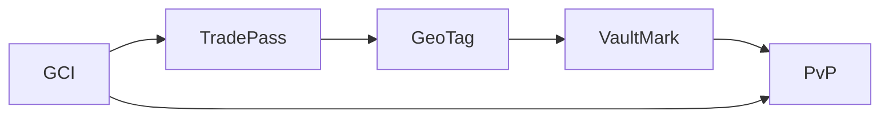
Protocols are composable, not strictly linear. TradePass authorizes capture, GeoTag produces signed evidence, VaultMark seals artifacts, and PvP gates settlement. GCI applies policies into both authorization and settlement.

#### Intelligence systems layer 🧠
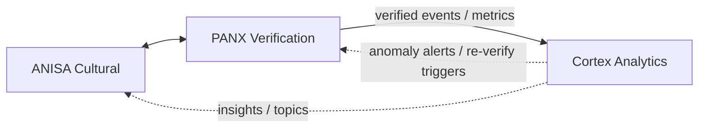
Intelligence systems enrich, verify, and analyze protocol artifacts. ANISA adds cultural context; PANX turns evidence + policy into network proofs; Cortex aggregates and visualizes signals for operators.

#### Platforms layer 🏛️
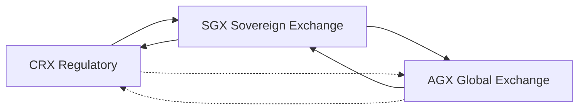
Platforms interoperate rather than strictly chain. CRX feeds sovereign approval/compliance into SGX; SGX returns market and custody events back to CRX. AGX connects multiple SGX instances to international buyers; limited CRX↔AGX links exist for export controls and revenue reporting.

## Actors and the problems we solve
| Actor | Pain today | What GTCX provides | Outcomes (targets) |
| --- | --- | --- | --- |
| Producers & cooperatives | Identity/origin not trusted; 6‑month permits; predatory middlemen; no price discovery | TradePass, GeoTag, GCI → CRX same‑day eligibility; SGX listing; VaultMark custody; PvP settlement | Onboard ≤1 day; eligibility ~2 min; better pricing; fraud reduction |
| Exporters & aggregators | Paper chains; disputed lots; delays at ports | VaultMark sealed custody; PANX proofs; CRX/SGX routing | Instant ownership verification; fewer holds; faster throughput |
| Regulators & ministries (CRX) | Fragmented systems; leakage; long queues | CRX workflow + policy engine; GCI attestations; audit trail | Permits ≤ 6 hours; +revenue capture; transparent audits |
| Vaults, warehouses, logistics | Mixed inventory risk; manual logs; dispute exposure | VaultMark digital twins; GeoTag arrival/departure proofs | No mixing; verifiable chain; insurance/risk down |
| Buyers & traders (SGX/AGX) | Opaque provenance; counterparty risk; slow settlement | Proof‑backed listings; PvP atomic settlement | Trusted supply; <1s settlement at execution |
| Banks/PSPs & settlement rails | Reconciliation risk; chargebacks; manual compliance | PvP orchestration; proof references; policy gating | Both‑or‑neither finality; automated compliance |
| Auditors & civil society | ESG unverifiable; after‑the‑fact investigations | Sealed artifacts (VaultMark), location proofs, policy history | Real‑time verification; credible oversight |

## 2. Problems and protocols

### Day in the life (epic, but real) 📽️

### Producer (cooperative lead)
Steps: Register in TradePass (~30s) → Pair GeoTag and capture evidence → GCI eligibility (~2 min) → CRX permit (≤ 6h) → Create VaultMark lot → List on SGX → PvP settlement (≤ 1s).
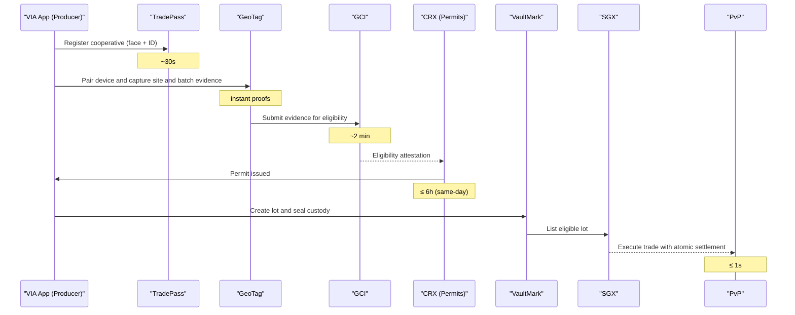

<b>Diagram legend:</b> Solid arrows = action/request; dashed arrows = signal/reference/gate; notes = "Note over X" for timing/context; quoted names include roles (e.g., "CRX (Permits)").

### Regulator (CRX operator)
- Intake arrives with TradePass identity and GCI eligibility attached
- CRX routes to departments; SLA timers start automatically
- Evidence links deep‑link to GeoTag artifacts and VaultMark seals
- Approver signs digitally; permit is issued with audit hash
- Dashboard shows queue, throughput, revenue capture, and anomalies
- Typical path: eligibility received ~2 min; permit turnaround same‑day (≤ 6h)

### Buyer (international)
Steps: Discover on SGX/AGX → Request PANX proof → Review details → Lock funds (PvP) → Verify custody (VaultMark) → Both‑or‑neither execute.
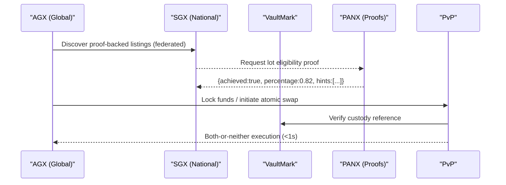

### Problems we solve
Trade today fails in predictable ways. The GTCX stack addresses each failure with a concrete, verifiable mechanism.

- **Identity without portability**: Registries, paper IDs, and manual KYC do not travel across agencies or borders. Every jurisdiction restarts the process, creating weeks‑long queues and inconsistent permissions. TradePass issues cryptographically verifiable identities and time‑boxed roles so authorization is portable, least‑privilege, and auditable.

- **Provenance without proof**: Documents move faster than goods. By the time a lot reaches the port, origin can be disputed, lots can be mixed, and there is no independent way to verify claims. GeoTag anchors events to cryptographic location and time, while VaultMark binds those events to sealed digital custody so provenance can be checked instantly, without calling the source.

- **Policy without consistency**: Rules are clear on paper but applied differently in practice. Interpretations diverge across desks and regions, creating bottlenecks, leakage, and unpredictable outcomes. GCI evaluates eligibility the same way every time against explicit policies, and CRX turns those decisions into transparent workflows with measurable SLAs.

- **Settlement without finality**: Payment and delivery occur on separate rails, leaving counterparties exposed and disputes to escalate. PvP settles “both‑or‑neither” atomically, using VaultMark custody references and PANX proof links so execution is instant, correct, and independently auditable.

### Market reality
| Metric | Current State | Impact |
| ---| ---| --- |
| Annual commodity trade | ~$13T | Massive addressable scope |
| Value lost to frictions | ~30% (≈$3.9T) | Efficiency upside |
| Permit processing | ~6 months | Deals die waiting |
| Origin verification | ~0% | ESG impossible |
| Digital infrastructure | Paper/PDF | 2025 still manual |

### Structural failures
| Structural failure | Description |
| --- | --- |
| Identity without trust | Weeks to verify; rampant fraud |
| Location without proof | Origin mixing; unverifiable chain |
| Compliance without speed | Rules change; processes don’t |
| Settlement without certainty | Intermediaries; failed trades |

### Protocols (foundation)
Core protocol specifications are snapshot inside this organization’s protocol repositories.

| Protocol | Purpose | Key elements |
| :-- | :-- | :-- |
| TradePass | Identity & authorization | DIDs/VCs; roles; entitlements |
| GCI | Compliance & policy | credentials; attestations; scoring |
| GeoTag | Evidence | cryptographic location; timestamping; device attestation |
| VaultMark | Audit | sealed receipts; custody chain |
| PvP | Settlement | post‑verification; atomic payment‑versus‑physical |

Transport and data contracts use JSON Schema with versioned `$id`.

### The five protocols (deep dives)
- TradePass (Identity & Authorization): DIDs/VCs, role catalogs, time‑boxed grants, least‑privilege; composes with GCI and PANX weights
- GCI (Compliance & Policy): attestations, algorithmic scoring, jurisdictional policies, predictive risk; gates roles and settlement
- GeoTag (Evidence): multi‑constellation GPS, satellite correlation, HSM signatures, Merkle proofs; replaces claims with proofs
- VaultMark (Audit): physical‑digital binding (NFC/RFID), digital twins, immutable custody; prevents verification washing
- PvP (Settlement): atomic payment‑versus‑physical; settlement only when proof+policy pass

#### Protocol outcomes
| Layer | Before | After |
| --- | --- | --- |
| TradePass | 3 weeks manual checks | ~30 seconds verification |
| GeoTag | Origin unverifiable | Instant cryptographic location proof |
| GCI | Weeks to evaluate | ~2 minutes eligibility |
| VaultMark | Custody breaks; disputes | Continuous sealed audit; instant ownership check |
| PvP | 3–5 day wires; exposure | Atomic settlement < 1s; both‑or‑neither finality |

<!-- Removed high-level A→B→C diagram to reduce redundancy -->

## 3. Architecture and flows

### Three‑tier architecture (overview) 🏗️
- **CRX — Regulatory Exchange**: for ministries and agencies to automate permits and apply policy consistently. Solves long queues, leakage, and inconsistent approvals with transparent workflows and SLAs. [CRX README](gtcx-ecosystem-platforms/README.md)
- **SGX — Sovereign National Exchange**: for domestic buyers, traders, vaults, and banks to list and settle proof‑backed lots. Solves opaque provenance and counterparty risk. [SGX README](gtcx-ecosystem-platforms/README.md)
- **AGX — Authenticated Global Exchange**: for international buyers and exporters to discover and trade across federated SGX markets. Solves fragmented discovery and cross‑border execution. [AGX README](gtcx-ecosystem-platforms/README.md)

### Verification layers → platforms (visual)
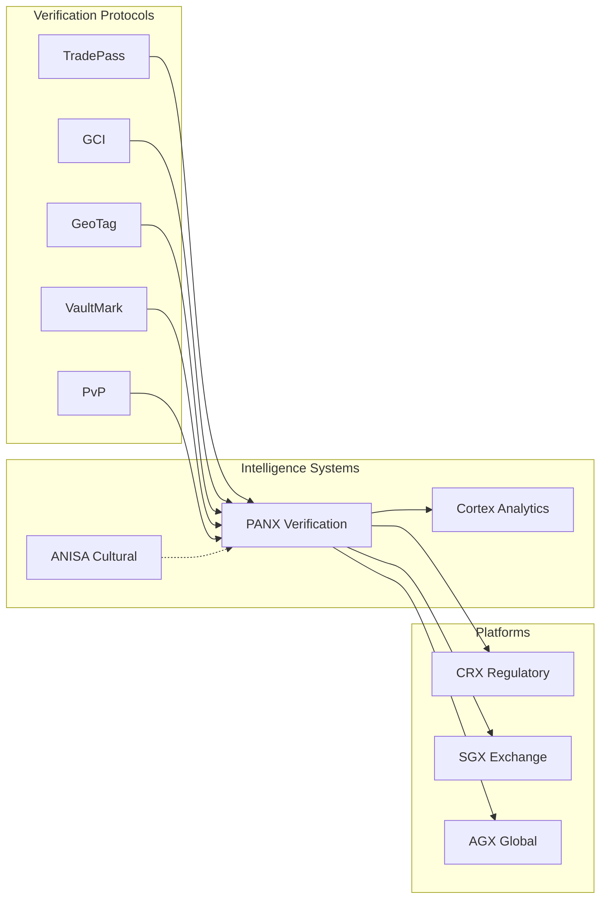

## 4. Using the system

### Use cases (flagship)
- Permit issuance (regulator): GCI decides eligibility the same way every time; CRX issues with an audit trail; VaultMark references seal artifacts. Time drops from months to hours.
- Depart/arrive verification (logistics): GeoTag evidence + VaultMark custody → PANX proof; Cortex raises real‑time alerts for anomalies.
- Corridor policy enforcement (government): GCI applies explicit rules; TradePass gates roles; decisions are consistent and explainable.
- Milestone‑based payment (banks): PANX proof drives PvP release; VaultMark custody prevents mixing; settlement is atomic.
- Dispute packet (operators): VaultMark + GeoTag + GCI produce a complete, sealed bundle others can independently verify.

## Pilot plan (one week)
Day 1 — Site onboarding
- Issue TradePass; pair GeoTag; enable VaultMark seals; create first lot.

Day 2 — Capture and verify
- Record depart/arrive with signed evidence; PANX thresholds per event type.

Day 3 — Govern and simulate
- GCI policy gates; simulate corridor rules; tune thresholds with dissent capture.

Day 4 — Dry‑run settlement
- PvP release conditions on proof references; bank/rail integration dry‑run.

Day 5 — Report and review
- Sealed audit bundle; metrics in Cortex; operator retro.

Telegram TradeBox
- Chat‑first onboarding (multi‑language, low bandwidth) for producers and clerks; see the TradeBox journey below.

### Glossary
- Protocol — shared rulebook and data contracts
- Proof — evidence‑backed claim you can independently verify
- Seal — tamper‑evident record preserved for audit
- Atomic settlement — payment/delivery only complete together
- Eligibility — outcome of GCI policy evaluation
- Custody — chain of ownership and control recorded by VaultMark
- Threshold — role‑weighted rule in PANX required to reach proof “achieved”

## 5. Reference

### Three‑tier architecture 🏗️
1) Protocols — specifications and data contracts (research repo)
2) Intelligence systems — PANX, Cortex, ANISA (this org)
3) Platforms and apps — Exchanges and Field‑First Mobile Applications

#### Protocols layer

Protocols are composable, not strictly linear. TradePass authorizes capture, GeoTag produces signed evidence, VaultMark seals artifacts, and PvP gates settlement. GCI applies policies into both authorization and settlement.

#### Intelligence systems layer

Intelligence systems enrich, verify, and analyze protocol artifacts. ANISA adds cultural context; PANX turns evidence + policy into network proofs; Cortex aggregates and visualizes signals for operators.

##### What actually happens (inputs → processing → outputs)
- ANISA (enrichment)
  - Inputs: site/production notes, local terms, stakeholder roles (TradePass), region hints (GeoTag)
  - Processing: cultural cues, etiquette, conflict‑avoidant phrasing, authenticity risk signals
  - Outputs: `{ authenticity_hint, tone_guidance, risk_notes[] }`
- PANX (verification)
  - Inputs: VaultMark lot metadata, GeoTag evidence, TradePass roles, GCI eligibility/policy
  - Processing: role‑weighted thresholds per event type, dissent capture, reasoned hints
  - Outputs: `{ proof_id, achieved: true|false, percentage, hints[], dissent[], contract_version }`
- Cortex (analytics)
  - Inputs: PANX proofs/events, custody/market telemetry, operator annotations
  - Processing: streaming aggregations, anomaly detection, trend/impact analyses
  - Outputs: `{ anomaly_alerts[], reverify_triggers[], dashboards, policy_insights[] }`

##### SLOs (typical targets)
- PANX verification (single event): p95 < 500ms; batch proofs: p95 < 2s
- Cortex alerting/trigger propagation: p95 < 1s end‑to‑end

#### Platforms layer

Platforms interoperate rather than strictly chain. CRX feeds sovereign approval/compliance into SGX; SGX returns market and custody events back to CRX. AGX connects multiple SGX instances to international buyers; limited CRX↔AGX links exist for export controls and revenue reporting.

## Intelligence systems (live repos)
[Back to top](#table-of-contents-)
- PANX (Oracle/Verification): `gtcx-ecosystem-cognitive/panx` — consensus, proofs, forward to Cortex
- Cortex (Analytics): `gtcx-ecosystem-cognitive/cortex` — ingest, summary, anomalies
- ANISA (Cultural Intelligence): `gtcx-ecosystem-anisa` — analyze/assess endpoints for enrichment

Each service includes: README, user/agent guides, runbooks, deploy guides, JSON Schemas, and changelogs.

## Open‑source platforms & tooling
[Back to top](#table-of-contents-)
- CRX — government workflow automation & regulatory processing
- SGX — sovereign national exchange & settlement
- AGX — authenticated global exchange (international marketplace)
- Terminal & UI shells — operator dashboards and community views (repos under `gtcx-ecosystem-platforms/`)
- APIs & gateways — shared adapters and routing (`gtcx-ecosystem-api-gateway/`)
- Research & specs — canonical protocol drafts and design notes (this org)

### Access layer: CaaS, VIA, VXA
- CaaS: simple APIs that wrap protocol workflows for apps and services
- VIA (teach & guide) and VXA (inspect & verify) mobile apps leverage the protocols end‑to‑end
- See: [platforms readme](gtcx-ecosystem-platforms/readme.md) (platforms overview and app shells)

### End‑to‑end trade process (custody before SGX)
[Back to top](#table-of-contents-)
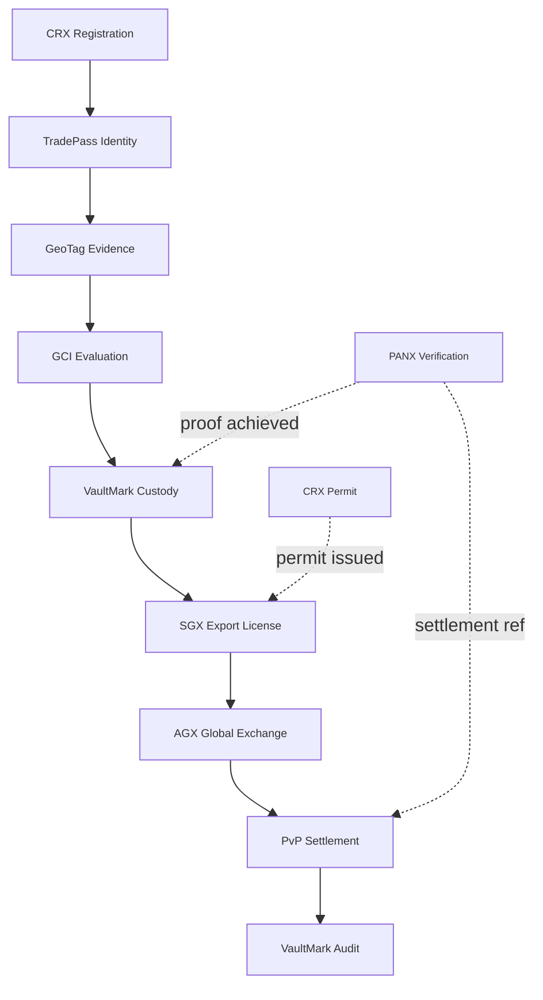

### Verification gates (at a glance)
[Back to top](#table-of-contents-)
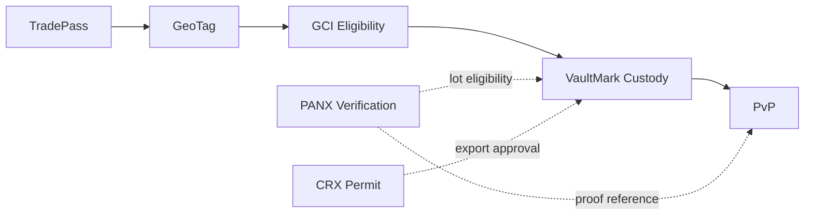

### What this enables (plain English)
[Back to top](#table-of-contents-)
- A farmer can become trade‑eligible the same day (TradePass, GeoTag, GCI, CRX), list nationally (SGX), and settle with an international buyer atomically (PvP) — with every custody move sealed (VaultMark) and every step independently verifiable.

### End‑to‑end sequence (eligibility first, then trade)
[Back to top](#table-of-contents-)

<ol>
<li>CRX registers and issues TradePass.</li>
<li>TradePass authorizes GeoTag capture.</li>
<li>GeoTag submits signed evidence to GCI.</li>
<li>GCI returns eligibility to TradePass/CRX.</li>
<li>When ready: create VaultMark custody lot.</li>
<li>PvP reads custody/proof references and settles atomically.</li>
</ol>

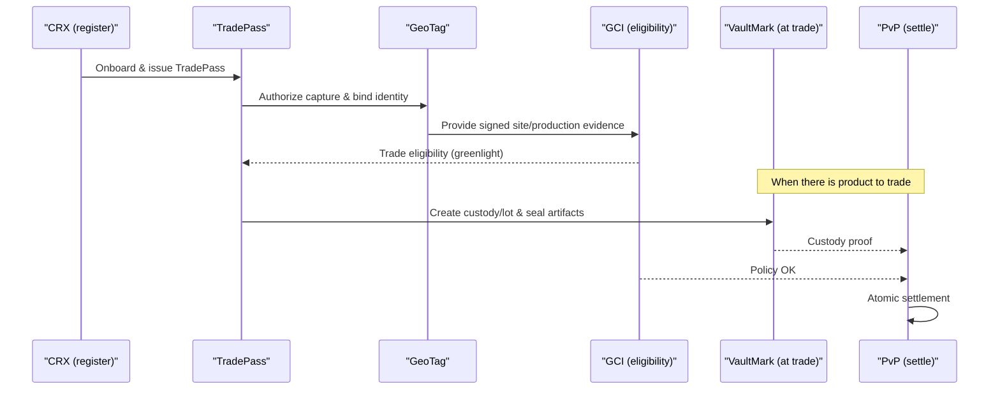

### “Trade in ~6 hours”
[Back to top](#table-of-contents-)
- Identity verified (TradePass): ~30 seconds
- Site/production evidence (GeoTag): instant
- Compliance eligibility (GCI): ~2 minutes
- Permit issuance (CRX): target same‑day, typical ≤ 6 hours
- Listing & broadcast (SGX→AGX): instant after permit
- Atomic settlement (PvP): < 1 second when trade executes

### Performance snapshots
[Back to top](#table-of-contents-)
VaultMark (chain of custody)

| Before | After (VaultMark) |
| --- | --- |
| Paper trail breaks, mixing common | Unbroken digital chain, sealed records |
| 3–5 days to verify ownership | Instant verification |
| Frequent custody disputes | Cryptographic proof across transfers |

PvP (settlement)

| Before | After (PvP) |
| --- | --- |
| 3–5 business days wire transfer | Atomic settlement < 1s |
| Intermediaries required | Direct counterparty exchange |
| 15% failed trades, exposure risk | Both‑or‑neither finality |

## Contracts and versioning
- Schemas: JSON Schema with stable `$id` and semantic versioning
  - Shared interfaces: `gtcx-ecosystem-cognitive/shared/interfaces/`
  - PANX request/response: `panx_verification_event.schema.json`, `panx_verify_response.schema.json`
  - Cortex ingest: `cortex_ingest_event.schema.json`
- Runtime signaling
  - Response header: `X-Contract-Version: vMAJOR.MINOR`
  - Backward‑compatible additive changes bump MINOR; breaking changes bump MAJOR with deprecation window
- Tooling & checks
  - Compatibility script: `gtcx-ecosystem-cognitive/shared/interfaces/contracts_compat_check.py`
  - CI suggestion: validate schemas + sample instances on PRs (can be run locally now)
  - Environment override for schema paths in containers: see `panx/service/app/validation.py`

## Deploy
- Try it now (local, copy‑paste)
  - PANX verify (replace API key and URL):
    - `curl -s -H "Authorization: Bearer $PANX_API_KEY" -H "Content-Type: application/json" -d '{"event_type":"lot_eligibility","lot_id":"vm_demo_001"}' https://your-panx-host/verify | jq`
  - Cortex ingest (replace URL):
    - `curl -s -H "Content-Type: application/json" -d '{"event":"demo_event","ts":1234567890}' https://your-cortex-host/ingest | jq`
- Start in Telegram (TradeBox): search for the official bot handle and tap Start
- Local Docker Compose (PANX + Cortex + DB)
  - Compose: `gtcx-ecosystem-cognitive/docker-compose.yml`
  - PANX service: [panx service readme](gtcx-ecosystem-cognitive/panx/service/readme.md)
- GCP VM (TLS via Caddy)
  - Overlay & guide: [compose‑prod readme](gtcx-ecosystem-cognitive/infra/compose-prod/readme.md)
  - Env template: `gtcx-ecosystem-cognitive/infra/compose-prod/ENV.example`
- ANISA API
  - Deploy guide: [ANISA deploy guide](gtcx-ecosystem-anisa/agile-pm/deploy_gcp_vm.md)
- Planned
  - Helm charts & GKE Autopilot manifests
  - Terraform modules for VM + DNS + secrets

## Roadmap (high‑level)
### Roadmap at a glance (visual)
```mermaid
flowchart LR
  subgraph NOW["Now — Foundational"]
    A1["Protocol hardening & schema snapshots"]
    A2["Compatibility CI (schemas + fixtures)"]
    A3["Reference SDKs (TS/Py)"]
  end

  subgraph NEXT["Next — Interoperability & Operations"]
    B1["TradePass federation"]
    B2["PvP multi‑rail connectors"]
    B3["GeoTag secure attestation"]
    B4["VaultMark smart seals & twins"]
    B5["Persistence & retention (partitioning/TTL)"]
    B6["Observability (metrics, SLOs, tracing)"]
  end

  subgraph LATER["Later — Agentic & Pilots"]
    C1["PANX re‑verify plans & dynamic thresholds"]
    C2["Cortex anomaly watchers & proposals"]
    C3["Pilots & corridor playbooks"]
    C4["Telegram onboarding funnels"]
  end

  A1 --> A2 --> A3 --> B1
  B1 --> B2 --> B3 --> B4 --> B5 --> B6 --> C1 --> C2 --> C3 --> C4
```

<!-- Consolidated roadmap details to the protocols repository and internal planning docs for brevity. -->

<!-- Community and governance section intentionally removed for brevity in this public overview. -->

## Telegram onboarding (fast path)

### TradeBox: chat‑first onboarding that meets users where they are
TradeBox is our Telegram experience that gets producers, exporters, and officials live in hours—not weeks. It turns identity, provenance, and permits into a guided conversation that runs on any phone, in low bandwidth, in local languages.

- Bot and utilities: [Telegram bot README](gtcx-ecosystem-shared/utilities/gtcx-utility-telegrambot/README.md) · [TradeDesk README](gtcx-ecosystem-shared/utilities/gtcx-utility-tradedesk/README.md)
- Strategy (narrative): [Telegram bot strategy](gtcx-ecosystem-specs/telegram/telegram-bot-strategy.md) · Commands and flows: [Bot commands](gtcx-ecosystem-specs/telegram/gtcx-bot-commands-readme.md)

### User journey (TradeBox)
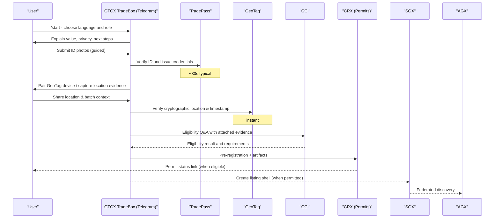

What you walk away with
- TradePass identity and roles you can show anywhere (QR or code)
- GeoTag setup and a first signed location proof
- Eligibility status and a CRX application in flight
- If permitted: a listing shell in SGX discoverable via AGX

Operator view (why it works at scale)
- Languages, voice, and offline queuing reduce friction dramatically
- Structured captures push clean artifacts into TradePass/GeoTag/VaultMark
- PANX/Cortex hooks let ops monitor completion, anomalies, and progress
