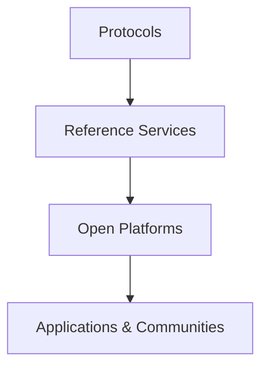
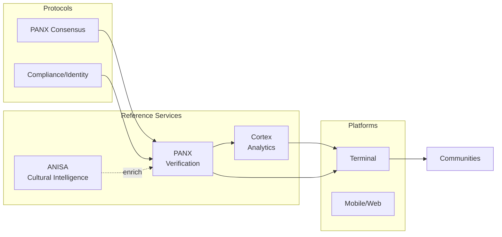

# GTCX Protocol Ecosystem

Public home for the GTCX protocols, reference services, and open‑source platforms.

Updated: 2025-09-02

## What is GTCX?
GTCX is an open protocol stack for trustworthy global trade. It focuses on verifiable events, culturally aware intelligence, and practical tools that work inclusively across regions.

## Protocols (foundation)
Core protocol specifications live in `gtcx-ecosystem-research/02-protocol-specifications/`.
- PANX Oracle Consensus — role‑weighted consensus, event‑type thresholds, auditable proofs
- Governance/Compliance/Identity — building blocks for compliant trade flows
- Transport and data contracts — JSON Schema with versioned `$id`

## Three‑tier architecture
1) Protocols — specifications and data contracts (research repo)
2) Reference services — PANX, Cortex, ANISA (this org)
3) Platforms & apps — open‑source frontends, terminals, and integrations

## Reference services (live repos)
- PANX (Oracle/Verification): `gtcx-ecosystem-cognitive/panx` — consensus, proofs, forward to Cortex
- Cortex (Analytics): `gtcx-ecosystem-cognitive/cortex` — ingest, summary, anomalies
- ANISA (Cultural Intelligence): `gtcx-ecosystem-anisa` — analyze/assess endpoints for enrichment

Each service includes: README, user/agent guides, runbooks, deploy guides, JSON Schemas, and changelogs.

## Open‑source platforms & tooling
- Terminal & UI shells — operator dashboards and community views (repos under `gtcx-ecosystem-platforms/`)
- APIs & gateways — shared adapters and routing (`gtcx-ecosystem-api-gateway/`)
- Research & specs — canonical protocol drafts and design notes (`gtcx-ecosystem-research/`)

## Contracts and versioning
- JSON Schema with `$id` across services
- Response header `X-Contract-Version`
- Compatibility checks included in repos (`contracts_compat_check.py`)

## Deploy
- Quickstart (VM + Docker Compose) in PANX/Cortex/ANISA READMEs
- Helm charts & GKE Autopilot (planned)

## Roadmap (high‑level)
- Protocol hardening and specification snapshots
- Schema‑first development with version guarantees
- Managed Postgres/Timescale persistence and retention
- Observability: metrics, dashboards, and alerting
- Agentic behaviors: PANX (borderline re‑verify plans), Cortex (watchers & action proposals)

## Community
- Issues and discussions in each repo
- Contributions welcome: docs, code, research

MIT License
