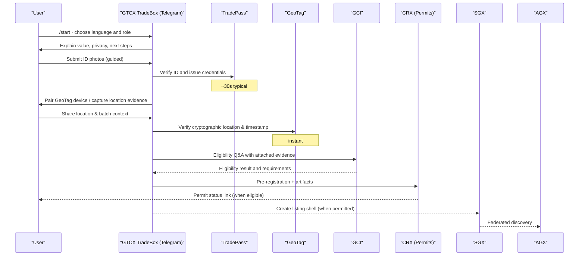

# Telegram onboarding (fast path)

## TradeBox: chat‑first onboarding that meets users where they are
TradeBox is our Telegram experience that gets producers, exporters, and officials live in hours—not weeks. It turns identity, provenance, and permits into a guided conversation that runs on any phone, in low bandwidth, in local languages.

- Bot and utilities: [Telegram bot README](../gtcx-ecosystem-shared/utilities/gtcx-utility-telegrambot/README.md) · [TradeDesk README](../gtcx-ecosystem-shared/utilities/gtcx-utility-tradedesk/README.md)
- Strategy (narrative): [Telegram bot strategy](../gtcx-ecosystem-specs/telegram/telegram-bot-strategy.md) · Commands and flows: [Bot commands](../gtcx-ecosystem-specs/telegram/gtcx-bot-commands-readme.md)

## User journey (TradeBox)

## What you walk away with
- TradePass identity and roles you can show anywhere (QR or code)
- GeoTag setup and a first signed location proof
- Eligibility status and a CRX application in flight
- If permitted: a listing shell in SGX discoverable via AGX

## Operator view (why it works at scale)
- Languages, voice, and offline queuing reduce friction dramatically
- Structured captures push clean artifacts into TradePass/GeoTag/VaultMark
- PANX/Cortex hooks let ops monitor completion, anomalies, and progress
